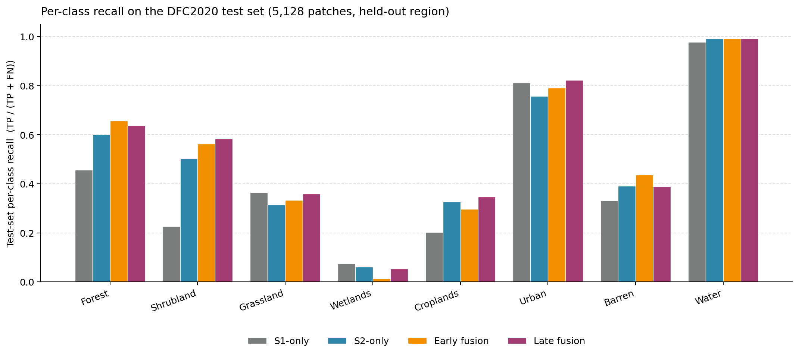
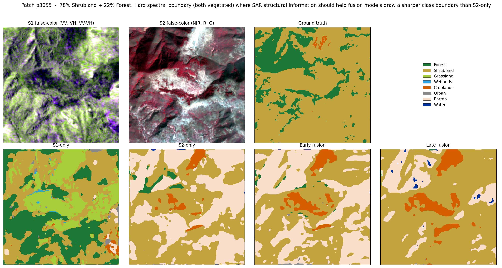
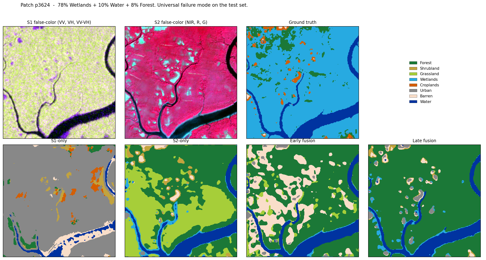
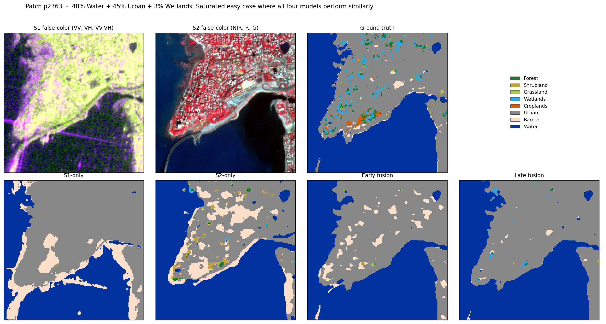

# SAR-Optical Fusion for Land Cover Segmentation (DFC2020)

A comparative study of four U-Net variants for combining Sentinel-1 SAR and Sentinel-2 optical imagery for land cover semantic segmentation, evaluated on the [2020 IEEE GRSS Data Fusion Contest](https://ieee-dataport.org/competitions/2020-ieee-grss-data-fusion-contest) benchmark.

**Status:** Phases 0–7 complete. Four models trained on the official validation set, single-shot evaluation on the held-out 5,128-patch test set, qualitative prediction figures, and full per-class analysis.

---

## Project goals

Train and compare four U-Net-based segmentation models on DFC2020, using identical training infrastructure so any performance differences reflect the modality or fusion choice and not implementation details:

1. **S1-only** baseline: Sentinel-1 SAR (VV + VH, 2 channels).
2. **S2-only** baseline: Sentinel-2 optical (12 channels; B10 dropped).
3. **Early fusion**: channel-wise concatenation of S1 and S2 at the input (14 channels).
4. **Late fusion**: dual-encoder architecture with per-scale concatenation + 1×1 conv fusion.

The central research question: **does SAR-optical fusion help, where do the gains come from, and how does the val-set picture survive on a held-out region?**

## Approach

The project is built to run on consumer hardware (single GTX 1050 Ti, 4 GB VRAM) with full reproducibility. Key design decisions:

- **Identical training pipeline across all four models.** Same loss, optimizer, schedule, augmentation, and train/val split. Only the model architecture and input channels change.
- **Honest evaluation.** Class weights computed on the training partition only. Best-model selection by mean class accuracy (mCA), not pixel accuracy, to avoid rewarding models that ignore minority classes. The test set is touched once, after training, with no hyperparameter adjustments.
- **Empirically selected split seed.** Seeds 0–99 were scored on per-class pixel-distribution preservation; seed 53 (max class deviation 0.96 %) was selected over the default seed 42 at 9.28 %.
- **Mixed-precision training (AMP)** to fit the U-Net on 4 GB VRAM at batch size 16.
- **Standard architectures, no domain-specific tricks.** ResNet-18 encoder with ImageNet pre-init, AdamW, cosine LR schedule, D4 augmentation (flips + 90° rotations). Results are intended to be a clean reference, not a leaderboard chase.

## Results

### Test-set results (held-out region, 5,128 patches)

These are the primary results of the project. The ranking is consistent with validation, the absolute numbers are substantially lower, and the per-class structure is where the interesting story lives.

| Metric | S1-only | S2-only | Early fusion | Late fusion |
| --- | --- | --- | --- | --- |
| Test mean class accuracy (mCA) | 0.430 | 0.494 | 0.510 | **0.523** |
| Test pixel accuracy (PA) | 0.532 | 0.604 | 0.622 | **0.633** |
| Test mean IoU | 0.290 | 0.353 | 0.361 | **0.381** |
| Parameters | 14.33 M | 14.36 M | 14.36 M | 26.24 M |



Per-class test recall on the 5,128-patch test set:

| Class | S1 | S2 | Early | Late |
| --- | --- | --- | --- | --- |
| Forest | 0.456 | 0.600 | **0.658** | 0.637 |
| Shrubland | 0.226 | 0.504 | 0.562 | **0.584** |
| Grassland | **0.365** | 0.315 | 0.333 | 0.358 |
| Wetlands | 0.074 | 0.061 | 0.013 | 0.053 |
| Croplands | 0.202 | 0.327 | 0.297 | **0.347** |
| Urban | 0.811 | 0.757 | 0.790 | **0.823** |
| Barren | 0.331 | 0.391 | **0.436** | 0.389 |
| Water | 0.977 | 0.993 | 0.992 | 0.993 |

### Key findings

**1. The architectural progression holds on test.** S1 < S2 < Early < Late is the same ordering observed on validation. Late fusion's +1.3 mCA over early fusion (val gap was +1.1) is preserved across the geographic shift, which is the strongest signal that the dual-encoder structure represents a real architectural improvement rather than a val-set artifact.

**2. Fusion's main win is Shrubland.** S1 alone struggles on this class (recall 0.226 on test); S2 alone manages 0.504; late fusion reaches 0.584. C-band cross-polarized backscatter encodes structural information about woody vegetation (branch density, surface roughness) that the Sentinel-2 spectral signature misses, especially at 10 m resolution where shrub patches often produce mixed pixels. This complementarity is the project's clearest empirical contribution.

**3. Wetlands collapses universally on test.** All four models score under 0.08 recall on Wetlands, with early fusion at 0.013. This is not an architecture problem. The class label spans visually heterogeneous land covers (salt marshes, riparian forests, peat bogs, flooded grasslands) and the training-set wetlands appear visually different from the test-set wetlands. No architectural fix can recover from a label-distribution shift this severe; only more diverse training data or domain-adaptation techniques would help.

**4. The val-to-test gap is large and almost uniform across models.** Every model loses 28–30 mCA points moving from validation to test. The gap doesn't favor any one architecture, which suggests the bottleneck is dataset diversity rather than model capacity or fusion strategy. The implication: improvements at the architecture level will plateau without complementary work on training-data coverage.

### Qualitative figures

Three test patches were selected to illustrate different aspects of the comparison:

- **Shrubland + Forest patch (p3055)**: where fusion clearly wins. The dual-encoder model produces a noticeably cleaner Shrubland/Forest boundary than S2 alone, with less spurious Barren prediction.
  

- **Wetlands-dominant patch (p3624)**: universal failure mode. None of the four models correctly identifies the marshland as Wetlands; the SAR-only model labels most of it as Urban, while the optical and fusion models predict Forest or Grassland.
  

- **Urban + Water patch (p2363)**: saturated easy case. All four models recover the coastline and city extent. S2-only catches fine intra-urban detail (small vegetated patches) that the fusion models smooth over — an interesting case where fusion's regularization slightly hurts on a class where it isn't needed.
  

### Validation results (for reference)

| Metric | S1-only | S2-only | Early fusion | Late fusion |
| --- | --- | --- | --- | --- |
| Best val mCA | 0.714 | 0.777 | 0.805 | **0.816** |
| Best val PA | 0.787 | 0.842 | 0.855 | 0.864 |
| Best val mIoU | 0.560 | 0.646 | 0.679 | 0.695 |

W&B runs:
[S1-only](https://wandb.ai/chavosh-personal/sar-optical-fusion-dfc2020/runs/mqszt3tn) ·
[S2-only](https://wandb.ai/chavosh-personal/sar-optical-fusion-dfc2020/runs/f1rh7skn) ·
[Early fusion](https://wandb.ai/chavosh-personal/sar-optical-fusion-dfc2020/runs/rygom44l) ·
[Late fusion](https://wandb.ai/chavosh-personal/sar-optical-fusion-dfc2020/runs/87hhz7gm)

## Limitations and honest framing

A portfolio project should be honest about what it does and does not show. The findings above come with three caveats worth stating explicitly:

**Parameter count is a confound for the early-vs-late comparison.** Late fusion has 26 M parameters versus 14 M for the other three models. Some of its +1.3 mCA improvement over early fusion may reflect added capacity rather than the dual-encoder architecture per se. The clean control would be a single-encoder model with a wider backbone (e.g., ResNet-34, ~21 M parameters), a planned ablation listed below.

**Barren regresses on test.** Late fusion's Barren recall (0.389) is below S2-only's (0.391). Across both val and test, the SAR signal for this class appears to inject more noise than it removes, and the dual-encoder model fails to learn to gate it. A class-aware fusion module (per-class learned modality weights) is the natural follow-up.

**The val-to-test gap is the largest single effect in the project.** Aggregate test mCA is 28–30 points below val mCA across all four models. This is consistent with the DFC2020 benchmark's known cross-region difficulty (the validation and test splits cover different geographies). It also means the absolute test numbers should be read as informative ranges rather than precision figures: "late fusion improves over S2 by roughly 3 mCA points on a hard test set" is more accurate than treating 0.523 as a precise estimate.

### Planned ablations and follow-ups

- **Backbone capacity control.** A single-encoder U-Net with ResNet-34 (~21 M params) to disentangle the late-fusion gain from raw capacity.
- **Class-aware gating** for Barren and other classes where one modality is informative and the other is not.
- **Predictive uncertainty** (MC-Dropout or deep ensembles) on the best fusion model, to quantify *when* fusion predictions can be trusted on out-of-distribution regions.
- **Domain adaptation** for the Wetlands collapse, using either adversarial domain alignment or test-time normalization.

## Dataset

See the [data exploration notebook](notebooks/01_data_exploration.ipynb) ([nbviewer link](https://nbviewer.org/github/Chavoshh/sar-optical-fusion-dfc2020/blob/main/notebooks/01_data_exploration.ipynb)) for the full analysis. Summary below.

The 2020 IEEE GRSS Data Fusion Contest dataset provides paired Sentinel-1 SAR and Sentinel-2 optical imagery with land cover labels, distributed as 256 × 256 patches.

| Split | Patches | Modalities per patch |
| --- | --- | --- |
| Validation (used for training and validation) | 986 | S1 (2 bands), S2 (13 bands), DFC label (1 band) |
| Test (held out, different geographic region) | 5,128 | S1 (2 bands), S2 (13 bands), DFC label (1 band) |

S1, S2, and label patches with matching IDs are pixel-aligned.

### Phase 1 findings

Exploratory analysis across all 986 validation patches produced the dataset statistics in `src/sar_optical_fusion/data/dataset_stats.json`, used throughout the pipeline. Headline findings:

- **Effective 8-class problem.** Classes 3 (Savanna) and 8 (Snow / Ice) have zero pixels in our data. The 8 classes present are Forest, Shrubland, Grassland, Wetlands, Croplands, Urban, Barren, and Water — matching the official DFC2020 evaluation scheme.
- **12× class imbalance.** Water alone is 35 % of pixels; Barren is the rarest at 2.9 %. Addressed via class-weighted cross-entropy with inverse-square-root frequency weights.
- **B10 (cirrus) carries no surface signal** (dataset-wide mean ≈ 11, std ≈ 5). Dropped from model input, reducing Sentinel-2 from 13 to 12 channels.
- **Per-channel outlier clipping.** S1 and S2 inputs are clipped to dataset-wide [p1, p99] before z-score normalization, preventing extreme values from dominating gradients.
- **No "no data" pixels.** Class 0 (no data) is absent throughout; no `ignore_index` needed.

### Class index mapping

`CrossEntropyLoss` requires contiguous indices. The 8 raw DFC class IDs are remapped:

| Train index | Raw DFC ID | Class | Pixel share (train split) |
| --- | --- | --- | --- |
| 0 | 1 | Forest | 8.95 % |
| 1 | 2 | Shrubland | 5.33 % |
| 2 | 4 | Grassland | 11.73 % |
| 3 | 5 | Wetlands | 17.57 % |
| 4 | 6 | Croplands | 13.11 % |
| 5 | 7 | Urban | 5.45 % |
| 6 | 9 | Barren | 2.90 % |
| 7 | 10 | Water | 34.96 % |

Mapping follows Schmitt et al. (2020), making results comparable to published baselines. Defined as `RAW_TO_TRAIN_ID` in `src/sar_optical_fusion/data/dataset.py`.

### Normalization constants

**S1 (dB):**

| Channel | Mean | Std | p1 | p99 |
| --- | --- | --- | --- | --- |
| VV | −13.95 | 4.33 | −23.18 | −4.16 |
| VH | −21.54 | 6.00 | −34.39 | −11.79 |

**S2 (reflectance × 10000, uint16):** per-band means range from 638 (B9) to 2370 (B8A); per-band standard deviations from 170 (B1) to 1490 (B8A). Full per-band statistics in `dataset_stats.json`.

### Train/validation split

The 986 validation-set patches are partitioned 80 % train (789) / 20 % validation (197). The 5,128 test patches are held out entirely until final evaluation.

The split is generated by `build_train_val_split` in `src/sar_optical_fusion/data/splits.py` using `seed=53` (pinned as `DEFAULT_SEED`). The seed was selected by evaluating seeds 0–99 on per-class pixel-distribution preservation; seed 53 produces a 0.96 % max class deviation between train and val versus 9.28 % for seed 42. The resulting partition is committed as `src/sar_optical_fusion/data/splits.json` to guarantee identical training data across all four model variants.

## Tech stack

- PyTorch 2.5 (CUDA 12.1) + segmentation-models-pytorch
- rasterio for geospatial I/O
- albumentations for augmentation
- Hydra for configuration
- Weights & Biases for experiment tracking
- uv for environment management

## Reproducibility

Environment is fully pinned via `uv.lock`. To reproduce:

```bash
git clone https://github.com/Chavoshh/sar-optical-fusion-dfc2020.git
cd sar-optical-fusion-dfc2020
uv sync
```

Data (~19 GB) must be obtained separately from the [DFC2020 page](https://ieee-dataport.org/competitions/2020-ieee-grss-data-fusion-contest) and placed in `data/`. See [`data/README.md`](data/README.md) for the expected layout.

Train any of the four experiments:

```bash
uv run python scripts/train.py experiment=s1_only
uv run python scripts/train.py experiment=s2_only
uv run python scripts/train.py experiment=early_fusion
uv run python scripts/train.py experiment=late_fusion
```

Evaluate a trained checkpoint on the held-out test set:

```bash
uv run python scripts/evaluate.py --checkpoint checkpoints/late_fusion/best.pt --num-workers 0
```

Generate the qualitative prediction figures:

```bash
uv run python scripts/select_test_patches.py
uv run python scripts/plot_prediction_grids.py
uv run python scripts/plot_per_class_comparison.py
```

## License

MIT — see [LICENSE](LICENSE).